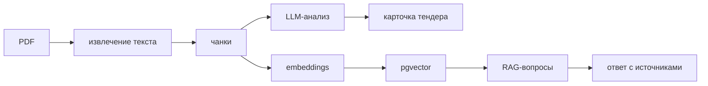

# Tender Intelligence

Веб-сервис для загрузки и анализа тендерной документации, а также поиска ответов по содержимому документов с указанием источников.

Сейчас реализованы безопасная загрузка PDF, постраничное извлечение текста, разбиение на фрагменты, структурированная карточка тендера, RAG-вопросы с источниками через pgvector и веб-интерфейс на Jinja2 с HTMX.



## Требования к окружению

- Python 3.12;
- PostgreSQL с расширением pgvector;
- Docker и Docker Compose.

## Локальная конфигурация

Создайте локальный файл окружения на основе примера:

```bash
cp .env.example .env
```

Основные переменные:

| Переменная | Назначение | Значение по умолчанию |
| --- | --- | --- |
| `APP_DATABASE_URL` | подключение SQLAlchemy к PostgreSQL | локальная БД `tender_intelligence` |
| `APP_STORAGE_PATH` | каталог исходных PDF | `storage/uploads` |
| `APP_UPLOAD_MAX_SIZE_MB` | предел размера файла | `25` |
| `APP_TEXT_CHUNK_SIZE_CHARS` | целевой размер чанка | `1200` |
| `APP_TEXT_CHUNK_OVERLAP_CHARS` | перекрытие чанков | `200` |
| `APP_LLM_PROVIDER` | `openai` или `ollama` | `openai` |
| `APP_LLM_BASE_URL` | OpenAI-совместимая точка доступа | `https://api.openai.com/v1` |
| `APP_LLM_API_KEY` | ключ облачного провайдера | пусто |
| `APP_LLM_MODEL` | модель анализа и ответов | `gpt-4o-mini` |
| `APP_EMBEDDING_MODEL` | модель embeddings | `text-embedding-3-small` |
| `APP_RAG_TOP_K` | число кандидатов поиска | `5` |
| `APP_RAG_MIN_RELEVANCE` | минимальная релевантность | `0.15` |
| `APP_HTTP_PORT` | внешний порт Compose | `8000` |

Полный перечень настроек с безопасными примерами находится в `.env.example`. Секреты не должны попадать в Git.

## Запуск через Docker Compose

Для демонстрационного запуска достаточно выполнить:

```bash
docker compose up --build
```

После готовности контейнеров веб-интерфейс доступен по адресу `http://localhost:8000`, а OpenAPI — по адресу `http://localhost:8000/docs`.

Интерфейс позволяет загрузить PDF, следить за статусом обработки без ручного обновления страницы, открыть карточку тендера и вести историю вопросов с источниками. HTMX версии 2.0.10 хранится локально, поэтому для работы страниц не требуется подключение к CDN.

Compose поднимает два сервиса:

- `app` — FastAPI-приложение, которое перед запуском применяет миграции;
- `postgres` — PostgreSQL с расширением pgvector.

Данные PostgreSQL и загруженные документы сохраняются в отдельных Docker volumes. Внешний порт приложения можно изменить через `APP_HTTP_PORT`.

Остановка контейнеров без удаления данных:

```bash
docker compose down
```

Удалять volumes для обычного перезапуска не требуется.

## Загрузка документов

Документ можно загрузить через OpenAPI или командой:

```bash
curl -F "file=@document.pdf;type=application/pdf" http://localhost:8000/api/v1/documents
```

Сервис проверяет расширение, MIME-тип, PDF-сигнатуру и ограничение размера, после чего сохраняет файл потоково под безопасным внутренним именем. Максимальный размер задаётся переменной `APP_UPLOAD_MAX_SIZE_MB` и по умолчанию равен 25 МБ.

Доступные операции:

- `POST /api/v1/documents` — загрузить PDF;
- `GET /api/v1/documents` — получить список документов;
- `GET /api/v1/documents/{document_id}` — получить документ по идентификатору.

Сразу после загрузки документ получает статус `uploaded`, затем фоновая обработка переводит его в `processing`. После успешного извлечения текста устанавливается `ready`, а понятная причина ошибки сохраняется вместе со статусом `failed`.

Текст извлекается отдельно для каждой страницы с сохранением исходной нумерации. PDF без текстового слоя завершается ошибкой: OCR сканов не входит в текущую версию проекта.

Фрагменты не пересекают границы страниц и по возможности завершаются на границе абзаца, строки или предложения. Для каждого фрагмента сохраняются номер страницы, последовательный индекс и точные символьные границы. Размер и перекрытие задаются переменными `APP_TEXT_CHUNK_SIZE_CHARS` и `APP_TEXT_CHUNK_OVERLAP_CHARS`.

## Карточка тендера

После готовности документа карточка формируется запросом:

```bash
curl -X POST http://localhost:8000/api/v1/documents/{document_id}/analysis
```

Сервис предварительно отбирает ограниченный набор релевантных фрагментов и запрашивает результат по строгой JSON-схеме. Для наименования закупки, заказчика, суммы, валюты, сроков, требований, штрафов и резюме возвращаются страницы и короткие точные цитаты. Значения без подтверждения отмечаются строкой `не найдено в документе`. Цитаты дополнительно сверяются с переданным контекстом перед сохранением в PostgreSQL.

Поддерживаются облачный OpenAI-совместимый API и локальный Ollama. Для облачного варианта задайте `APP_LLM_API_KEY`, `APP_LLM_MODEL` и при необходимости `APP_LLM_BASE_URL`. Для Ollama используйте:

```env
APP_LLM_PROVIDER=ollama
APP_LLM_BASE_URL=http://host.docker.internal:11434/v1
APP_LLM_MODEL=имя_локальной_модели
APP_EMBEDDING_MODEL=имя_модели_embeddings
```

Без настроенного провайдера загрузка и подготовка документов продолжают работать, а запрос анализа возвращает понятный ответ `503`.

Если провайдер настроен, embeddings создаются пакетно во время обработки документа. В PostgreSQL для каждого чанка сохраняются вектор и имя модели. Поиск использует cosine distance, фильтрует чанки по документу и модели, а количество результатов задаётся через `APP_RAG_TOP_K`.

## Вопросы по документу

Задать вопрос после подготовки документа:

```bash
curl -X POST \
  -H "Content-Type: application/json" \
  -d '{"question":"Какие требования предъявляются к исполнителю?"}' \
  http://localhost:8000/api/v1/documents/{document_id}/questions
```

Ответ формируется только по фрагментам выбранного документа. Результат содержит признак достаточности контекста и до пяти источников: страницу, цитату и релевантность. Для подтверждённого ответа требуется минимум два источника. Порог релевантности задаётся через `APP_RAG_MIN_RELEVANCE`. Если подходящего контекста недостаточно, сервис возвращает `Ответ не найден в документе.` и не дополняет его внешними сведениями.

История доступна через `GET /api/v1/documents/{document_id}/questions`. Вопрос, ответ и источники сохраняются одной транзакцией.

## Сценарий демонстрации

1. Откройте `http://localhost:8000` и загрузите PDF с текстовым слоем.
2. Дождитесь статуса «Готов» — страница обновится автоматически.
3. Сформируйте карточку тендера и проверьте цитаты у ключевых полей.
4. Задайте вопросы о цене, сроках, требованиях и штрафах.
5. Раскройте источники ответа и сопоставьте цитаты с указанными страницами.

## Ограничения

- OCR сканов и распознавание изображений не реализованы;
- защищённые паролем и повреждённые PDF могут не обрабатываться;
- фоновая задача выполняется внутри процесса приложения и не восстанавливается после его аварийного завершения;
- точность результата зависит от качества текста и выбранной модели, поэтому критичные сведения следует сверять с источниками;
- аутентификация и разграничение доступа не входят в локальную демонстрационную версию.

Подробности приведены в [описании решения](docs/solution.md), [архитектуре](docs/architecture.md) и [журнале решений](DECISIONS.md).

## Запуск без Docker

Запуск приложения в режиме разработки:

```bash
uvicorn app.main:app --reload
```

Проверки состояния доступны по адресам `/health/live` и `/health/ready`.

## База данных

Приложение использует PostgreSQL с расширением pgvector. Строка подключения и параметры пула задаются переменными `APP_DATABASE_*` из `.env.example`.

Применение миграций:

```bash
alembic upgrade head
```

Эндпоинт `/health/ready` возвращает успешный ответ только при доступном подключении к базе данных.

## Проверки качества

После установки зависимостей для разработки доступны команды:

```bash
ruff check .
ruff format --check .
mypy app tests migrations
pytest
```

Те же проверки автоматически выполняются в GitHub Actions при отправке изменений в `main`, ветки `feature/**` и в pull request к `main`.
