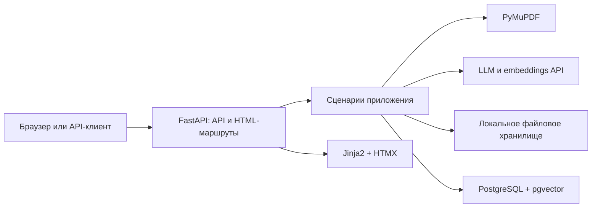
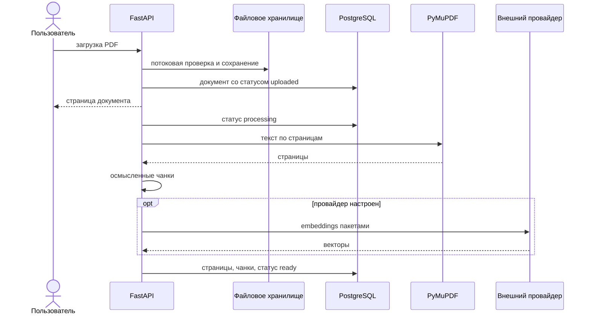

# Архитектура

## Границы приложения

Tender Intelligence — один FastAPI-сервис с PostgreSQL. HTTP-слой предоставляет JSON API и серверный интерфейс. Обработка запускается фоновой задачей процесса приложения; отдельная очередь в текущей версии не нужна.

## Слои

- `app/api` и `app/web` принимают запросы, связывают зависимости и преобразуют результат в JSON или HTML.
- `app/application` содержит сценарии загрузки, обработки, формирования карточки, векторного поиска и ответов на вопросы.
- `app/domain` описывает типы, строгие схемы результата, протоколы репозиториев и ожидаемые ошибки.
- `app/infrastructure` реализует PostgreSQL, файловое хранилище, извлечение PDF и OpenAI-совместимых провайдеров.
- `app/templates` и `app/static` содержат серверный интерфейс без отдельной сборки фронтенда.

Зависимости направлены от внешних слоёв к домену. Прикладная логика работает через протоколы, поэтому тесты заменяют БД и провайдеры управляемыми реализациями в памяти.

## Поток обработки

## Хранение

- `documents` — метаданные, контрольная сумма и состояние обработки;
- `document_pages` — извлечённый текст с исходной нумерацией;
- `document_chunks` — текст, символьные границы, модель embeddings и вектор;
- `tender_analyses` — проверенная карточка в JSONB и версия запроса;
- `questions` и `answer_sources` — история ответов и ссылки на конкретные чанки.

Исходные PDF находятся в отдельном Docker volume. Связанные строки БД удаляются каскадно.

## Развитие

Доменные протоколы позволяют заменить локальное хранилище объектным, вынести обработку в очередь или добавить другого провайдера без изменения HTTP-контрактов. Для нескольких процессов фоновые задачи следует заменить надёжной очередью с повторными попытками и идемпотентными заданиями.
